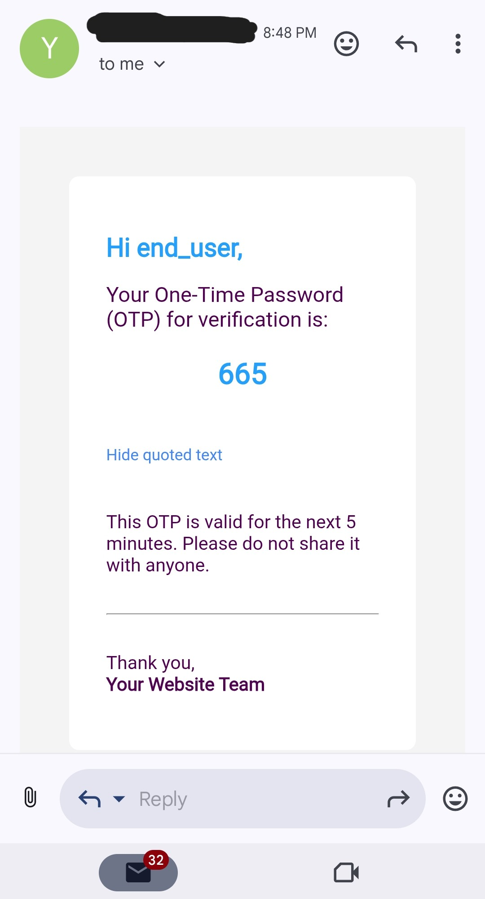
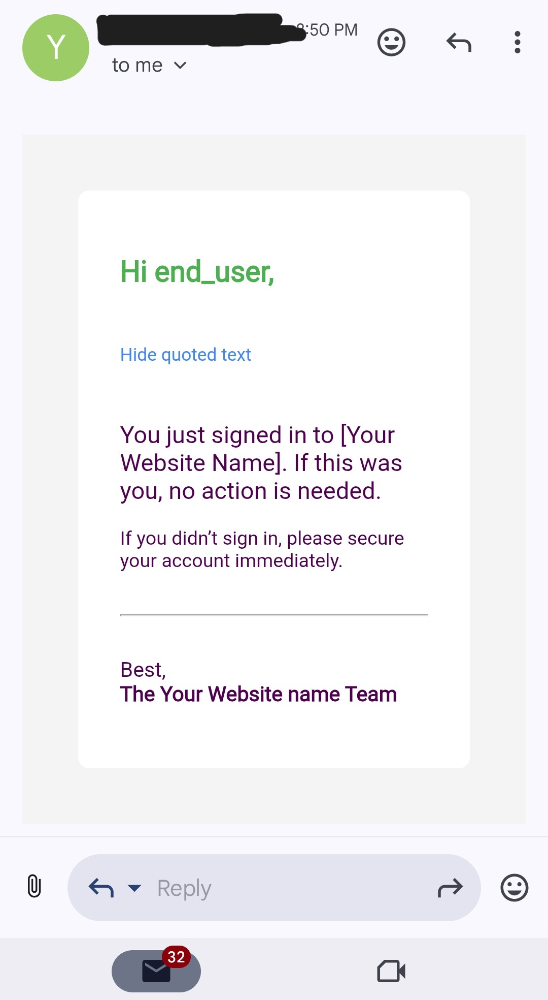

# Email OTP-Based Login System

This is a Django-based authentication system where users can log in using a One-Time Password (OTP) sent to their email. The system ensures secure and passwordless login by verifying the OTP within a specific time frame.

## Features

- OTP sent to user's email for login
- Secure authentication with Django sessions
- OTP expires after a configurable time (e.g., 5 minutes)
- Prevents OTP not reuse
- Basic login and logout flow
- Minimal frontend (HTML/CSS) for user interaction

## Tech Stack

- Python 3
- Django
- HTML / CSS
- SMTP (for sending OTP emails)

## How It Works
- User enters their email address on the sign_in page.

- A 3-digit OTP is generated and sent to the email.

- User enters the OTP on the verification page.

- If OTP is correct and within time limit, user is logged in.

- If incorrect or expired if you stay in otp verify page, appropriate error message is shown

## Screenshots
**sign_up image**

<p align="center">
  
</p>

  **otp image**
<p align="center">
  
</p>

**sign_in image**
<p align="center">
  
</p>

### More images in Screenshots folder

## Installation


### Option 1: Installation via ZIP Download
1. **Download ZIP:**

- Go to the repository page: GitHub Repository

- Click on the green Code button and select Download ZIP

- Extract the ZIP file to your preferred location

2. **Navigate to the project folder:**
```
cd email-otp-login-system-main  # or whatever the folder name is
```
3. **Create a virtual environment (optional but recommended):**
```
python -m venv venv
source venv/bin/activate  # On Windows: venv\Scripts\activate
```
4. **Install required packages:**
```
pip install -r requirements.txt
```
5. **Configure email settings:**

Open settings.py and update your email settings with your SMTP credentials.

6. **Run migrations:**
```
python manage.py migrate
```
7. **Start the server:**
```
python manage.py runserver
Open in your browser:

Visit http://127.0.0.1:8000 to test the app.
```

### Option 2
1. **Clone the repository:**

   ```
   git clone https://github.com/YLlshOTP-base-login-system
   cd email-otp-login-system
   ```
2. **Create a virtual environment:**
```
python -m venv venv
source venv/bin/activate  # On Windows: venv\Scripts\activate
```
3. **Install dependencies:**
```
pip install -r requirements.txt
```
4. **Update settings:**

In settings.py, configure your email backend:
```
EMAIL_BACKEND = 'django.core.mail.backends.smtp.EmailBackend'
EMAIL_HOST = 'smtp.gmail.com'
EMAIL_PORT = 587
EMAIL_USE_TLS = True
EMAIL_HOST_USER = 'your-email@gmail.com'
EMAIL_HOST_PASSWORD = 'your-app-password'

and first learn how to generate app-password of gmail

don't use real password
```
5. **Run migrations:**
```
python manage.py migrate
```
6. **Start the development server:**
```
python manage.py runserver
```
7. **Access the app:**
```
http://127.0.0.1:8000 in your browser.
```

